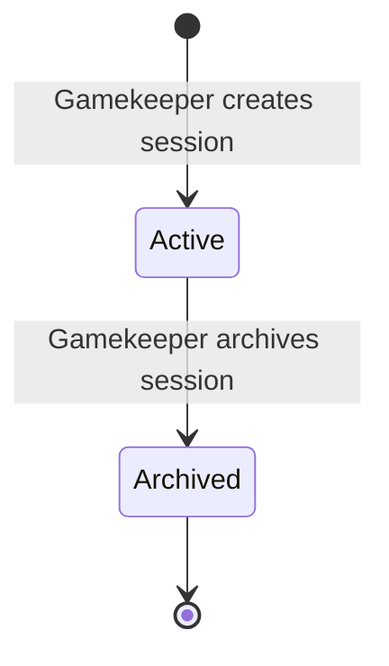
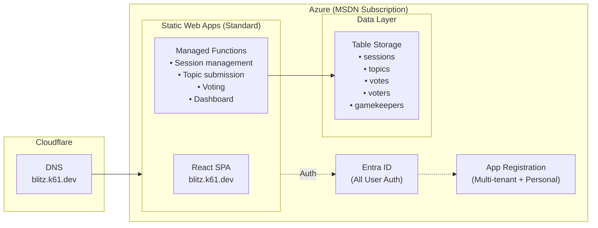

# Blitz Talks – Development Plan

**Production URL**: https://blitz.k61.dev
**Repository**: https://github.com/kurtzeborn/blitz-talks

---

## 1. Overview

A multi-day lightning talks platform where participants submit 5-minute talk topics and vote on which ones they want to hear. A gamekeeper manages the session from a projected dashboard, choosing speakers and marking talks as complete.

### Core Flow
1. **Gamekeeper** creates a session and projects a QR code
2. **Participants** scan QR code → sign in with Microsoft → confirm their name → submit 1-3 talk topics
3. **Participants** browse all proposed topics (no speaker names visible) and vote on the ones they want to hear
4. **Gamekeeper** projects a dashboard showing topics ranked by votes, picks speakers, and marks talks as complete
5. **Participants** earn additional votes over time by returning to the site, keeping engagement alive across multiple days

### What Makes This Different from Other Projects
- **Multi-day engagement** — not a single-session game; participants return over days
- **All users authenticate** — Microsoft login for everyone (personal + work/school accounts)
- **Vote regeneration** — votes replenish over time to encourage repeat visits
- **No score reveal** — it's not competitive; it's about surfacing the best topics

---

## 2. Requirements Summary

| Requirement | Value |
|------------|-------|
| Max Participants | ~100 per session |
| Topics per Participant | 1-3 |
| Must Submit to Vote | Yes — at least 1 topic required |
| Initial Votes | 3 (must be on distinct topics) |
| Vote Regeneration | +1 per site visit, if ≥ N hours since last grant (default 2h) |
| Max Votes per Visit | 1 additional (regardless of time elapsed) |
| Vote Withdrawal | Allowed (except from completed talks) |
| Vote Stacking | Initial 3 must be distinct; later votes can stack |
| Self-Voting | Allowed |
| Phone Display | Topics only — no speaker names |
| Dashboard Display | Topics + vote counts + speaker names (toggleable) |
| Multiple Sessions | Supported simultaneously |
| Authentication | Microsoft login for all users (personal + work/school) |

---

## 3. Session Lifecycle



Sessions are simple — there's no state machine like one-truth. A session is either **active** (accepting topics and votes) or **archived** (read-only). The gamekeeper controls when talks happen by marking them complete on the dashboard; there's no voting phase transition.

---

## 4. Platform

Mobile-first responsive web app. Participants join via QR code — no app install needed.

- Single codebase for phones (topic submission + voting) and projector (gamekeeper dashboard)
- Semantic HTML, keyboard navigation, color-blind friendly design

---

## 5. Authentication & Authorization

**All users** authenticate via Microsoft Entra ID (custom app registration supporting personal + work/school accounts). SWA Standard tier is required for custom auth configuration.

### Why Require Login for Everyone
- **Multi-day durability** — identity tied to Microsoft account, not fragile localStorage
- **Cross-device** — start on phone, check on laptop later
- **No spoofing** — vote limits enforced by authenticated identity
- **Simpler code** — no anonymous session management or recovery flows

### Custom Entra ID App Registration
Required because SWA's built-in AAD provider only supports work/school accounts. To accept personal Microsoft accounts (outlook.com, hotmail.com, etc.), we need:
- App registration configured for "Accounts in any organizational directory and personal Microsoft accounts"
- Issuer: `https://login.microsoftonline.com/common/v2.0`
- Client ID + secret configured in SWA app settings
- Redirect URI: `https://blitz.k61.dev/.auth/login/aad/callback`

### Auth Flow
1. User scans QR code → lands on session page
2. If not signed in, redirect to `/.auth/login/aad?post_login_redirect_uri=/session/XXXX`
3. SWA handles Microsoft sign-in (personal or work/school account)
4. `x-ms-client-principal` header provides email + display name claims
5. API uses email as unique identity

### Gamekeeper Authorization
- Same auth flow as participants
- Gamekeeper = email in allowlist table
- Any existing gamekeeper can invite others

### Multiple Accounts
A user can sign in with different Microsoft accounts. Each account is a separate participant — each must submit ≥1 topic to vote. This is by design (low risk, self-correcting).

### Display Name
- Auto-populated from Microsoft profile `name` claim as **first name + last initial** (e.g., "Scott K." from "Scott Kurtzeborn")
- Shown in a "Confirm your name" step on first registration for a session
- Editable — user can change to a nickname
- Stored per-session (not globally)

---

## 6. Architecture



**Architecture Notes:**
- **SWA Standard Tier** — Required for custom auth (personal Microsoft accounts). $9/month.
- **Custom App Registration** — Configured for multi-tenant + personal accounts. SWA uses client ID/secret from app settings.
- **Managed Functions** — Built into SWA, no separate Function App needed.
- **Auth Header Forwarding** — SWA forwards `x-ms-client-principal` to managed functions automatically.
- **No CORS Required** — All traffic flows through SWA (same origin).
- **No Blob Storage** — Text-only data.
- **Cloudflare DNS** — CNAME pointing to SWA hostname (proxy disabled for SSL compatibility).

---

## 7. Azure Cost Estimate

| Resource | Purpose | Estimated Monthly Cost |
|----------|---------|------------------------|
| **Azure Static Web Apps (Standard)** | Host React SPA + managed functions + custom auth | $9.00 |
| **Azure Table Storage** | All session/topic/vote data | < $0.01 |
| **Entra ID App Registration** | Microsoft auth for all users | $0.00 (included) |
| **Custom Domain (blitz.k61.dev)** | Subdomain of existing domain | $0.00 (already owned) |

**Total: ~$9/month** (Standard tier is the only real cost)

### Storage Calculations (per session, ~50 participants)
- 1 Session record: ~300 bytes
- 50 Voter records × ~200 bytes: ~10 KB
- ~100 Topic records × ~300 bytes: ~30 KB
- ~300 Vote records × ~150 bytes: ~45 KB
- **Total per session: ~85 KB** → negligible cost

---

## 8. Data Model

### Session
```typescript
interface Session {
  id: string;                  // 4-character alphanumeric code
  name: string;                // Display name (e.g., "Team Offsite 2026")
  status: 'active' | 'archived';
  voteIntervalMinutes: number; // Minutes between vote grants (default 120)
  createdBy: string;           // Gamekeeper's email
  createdAt: string;           // ISO 8601
}
```

**Table Storage:** PartitionKey = `'session'`, RowKey = `sessionId`

### Topic
```typescript
interface Topic {
  id: string;                  // UUID
  sessionId: string;
  title: string;               // The talk topic (what participants see)
  submittedBy: string;         // Email (hidden from participants)
  speakerName: string;         // Display name (hidden from participants)
  status: 'pending' | 'completed';
  voteCount: number;           // Denormalized for fast sorting
  completedAt?: string;        // ISO 8601 (set when gamekeeper marks complete)
  createdAt: string;           // ISO 8601
}
```

**Table Storage:** PartitionKey = `sessionId`, RowKey = `topicId`

### Vote
```typescript
interface Vote {
  sessionId: string;
  topicId: string;
  voterEmail: string;          // Who cast this vote
  count: number;               // Votes allocated to this topic by this voter (≥1)
  updatedAt: string;           // ISO 8601
}
```

**Table Storage:** PartitionKey = `sessionId`, RowKey = `${voterEmail}#${topicId}`

### Voter
```typescript
interface Voter {
  sessionId: string;
  email: string;               // From auth claims
  displayName: string;         // Confirmed/edited by user
  topicsSubmitted: number;     // Must be ≥1 to vote
  totalVotesGranted: number;   // Starts at 3, +1 per qualifying visit
  votesUsed: number;           // Sum of all vote counts (denormalized)
  lastVoteGrantedAt: string;   // ISO 8601 — when last vote was granted
  registeredAt: string;        // ISO 8601
}
```

**Table Storage:** PartitionKey = `sessionId`, RowKey = `email`

### Gamekeeper (Allowlist)
```typescript
interface Gamekeeper {
  email: string;               // Primary key (lowercase)
  displayName: string;         // From Microsoft profile
  addedBy: string;             // Email of who invited them
  addedAt: string;             // ISO 8601
}
```

**Table Storage:** PartitionKey = `'gamekeeper'`, RowKey = `email`

---

## 9. Voting Mechanics (Detailed)

### Initial Votes
- Granted when participant submits their **first** topic in a session
- 3 votes, must each go to a **different** topic
- Self-voting is allowed

### Vote Regeneration
- When a participant visits the site (any API call that checks vote status):
  1. Server reads `lastVoteGrantedAt` from voter record
  2. If `now - lastVoteGrantedAt >= voteIntervalMinutes`: grant +1 vote, update `lastVoteGrantedAt = now`
  3. If less time has elapsed: no new vote, respond with time remaining until next grant
- **Max 1 new vote per visit** regardless of how much time has passed (e.g., 12 hours away = still just 1 new vote)
- This encourages frequent return visits

### Vote Stacking Rules
| Votes Used So Far | Can Stack on Same Topic? |
|-------------------|-------------------------|
| 0-2 (first 3 votes) | No — must vote for 3 different topics |
| 3+ (subsequent votes) | Yes — can add more votes to any topic |

### Vote Withdrawal
- Participants can remove votes from any **pending** topic and reallocate them
- Votes on **completed** talks are locked — cannot be withdrawn
- Withdrawal decrements `votesUsed` and frees the vote for reuse
- The freed vote follows current stacking rules (if total used would drop below 3, the re-placed vote must go to a new topic)

### Server-Side Enforcement
All vote logic is server-side. The client displays remaining votes and next-refresh countdown but cannot manipulate the budget.

```
remainingVotes = totalVotesGranted - votesUsed
nextVoteAt = lastVoteGrantedAt + voteIntervalMinutes
canVoteForTopic(topicId) = 
  if votesUsed < 3: no existing vote on this topic
  else: true (stacking allowed)
```

---

## 10. API Endpoints

### Session Management (Gamekeeper Only)
```
POST   /api/sessions                           Create session (body: { name, voteIntervalMinutes? })
GET    /api/sessions                           List all sessions
PATCH  /api/sessions/:id                       Update session settings or archive
```

### Topic Submission (Authenticated, ≤3 per session)
```
POST   /api/sessions/:id/topics               Submit a topic (body: { title })
DELETE /api/sessions/:id/topics/:topicId       Remove own topic (only if pending, adjusts vote counts)
```

### Topic Listing
```
GET    /api/sessions/:id/topics                List topics — participants see title + voteCount only;
                                               gamekeepers see title + speakerName + voteCount + status
```

### Voting (Authenticated, must have ≥1 topic)
```
POST   /api/sessions/:id/votes                 Cast a vote (body: { topicId })
DELETE /api/sessions/:id/votes/:topicId        Withdraw a vote from a topic
GET    /api/sessions/:id/votes/me              My vote status: remaining, allocations, next refresh time
```

### Gamekeeper Dashboard
```
GET    /api/sessions/:id/dashboard             Full dashboard data: all topics with names, votes, status
PATCH  /api/sessions/:id/topics/:topicId       Mark talk complete or revert to pending (gamekeeper only)
```

### Gamekeeper Management
```
GET    /api/gamekeepers                        List all gamekeepers
POST   /api/gamekeepers                        Invite gamekeeper (body: { email })
DELETE /api/gamekeepers/:email                 Remove gamekeeper
GET    /api/me                                 Auth status + gamekeeper check + name claim
```

### Validation Rules
- Display names: 1-30 characters
- Topic titles: 1-100 characters
- Session names: 1-50 characters
- Session code: 4 alphanumeric characters (uppercase)
- Vote interval: 30-1440 minutes (30 min to 24 hours)
- Max 3 topics per participant per session
- Must submit ≥1 topic before voting
- Cannot delete a topic that has been completed

---

## 11. Detailed User Flow

### Participant Flow
1. Scan QR code → `blitz.k61.dev/?session=XXXX`
2. If not signed in → redirect to Microsoft sign-in
3. After sign-in → check if already registered for this session
4. **If new**: Show "Confirm your name" (pre-filled from Microsoft profile, editable) + "What topic would you like to present?" form
5. **If returning**: Show topics list + voting UI + "Submit another topic" option (if <3 submitted)
6. On first topic submission → server grants 3 votes
7. Browse topics (title only, no speaker names), cast votes
8. Return hours/days later → server grants +1 vote if interval has passed → vote on more topics

### Gamekeeper Flow
1. Sign in with Microsoft → verified against allowlist
2. Create a session (name + optional vote interval override)
3. Project the dashboard: QR code + ranked topic list
4. Toggle "Show Speaker Names" when choosing who speaks next
5. Select a talk → mark as complete → topic moves to completed list on dashboard
6. Completed talks disappear from participant phone view

### Projected Dashboard Layout
```
┌─────────────────────────────────────────────────┐
│  ⚡ Blitz Talks – Team Offsite 2026             │
│  Scan to submit & vote: [QR CODE]  Code: ABCD  │
├─────────────────────────────────────────────────┤
│  📋 Pending Topics                [Show Names]  │
│  ┌───┬────────────────────────┬───────┬──────┐  │
│  │ # │ Topic                  │ Votes │      │  │
│  ├───┼────────────────────────┼───────┼──────┤  │
│  │ 1 │ How I automated my ... │  12   │ [✓]  │  │
│  │ 2 │ Rust for backend devs  │   9   │ [✓]  │  │
│  │ 3 │ 5 VS Code extensions   │   7   │ [✓]  │  │
│  │ ...                                       │  │
│  └───────────────────────────────────────────┘  │
│                                                 │
│  ✅ Completed (3)                               │
│  ┌────────────────────────┬───────┐             │
│  │ GraphQL in 5 minutes   │  14   │             │
│  │ Why I love Bicep        │  11   │             │
│  │ Debugging prod at 3am  │   8   │             │
│  └────────────────────────┴───────┘             │
└─────────────────────────────────────────────────┘
```

---

## 12. Frontend Architecture

### Routing

| Route | Page | Access |
|-------|------|--------|
| `/` | Landing page — enter session code or sign in as gamekeeper | Public |
| `/?session=XXXX` | Auto-join session from QR code | Public (redirects to sign-in) |
| `/session/:id` | Participant view — submit topics, browse & vote | Authenticated |
| `/dashboard` | Gamekeeper — list sessions, create new | Gamekeeper |
| `/dashboard/:id` | Gamekeeper — projected session dashboard | Gamekeeper |
| `/dashboard/keepers` | Gamekeeper — manage allowlist | Gamekeeper |

### Participant View (`/session/:id`)

Two states based on whether the user has registered for this session:

1. **New participant**: Name confirmation + first topic submission form
2. **Registered participant**: Topic list with voting + "Add another topic" (if <3)

```typescript
function SessionPage() {
  const { voter, topics, voteStatus } = useSessionState();

  if (!voter) return <RegistrationForm />;

  return (
    <>
      <TopicList topics={topics} voteStatus={voteStatus} />
      {voter.topicsSubmitted < 3 && <AddTopicForm />}
      <VoteStatusBar remaining={voteStatus.remaining} nextRefresh={voteStatus.nextVoteAt} />
    </>
  );
}
```

### Participant Phone Layout
- **Topic cards**: Title + vote count + vote/unvote button
- **No speaker names** — only topic titles visible
- **Vote status bar**: "2 votes remaining · Next vote in 1h 23m"
- **Add topic**: Expandable form at top or bottom
- **Completed talks**: Hidden from participant view entirely

### Gamekeeper Dashboard (`/dashboard/:id`)
- Designed for projector (large fonts, high contrast)
- QR code + session code prominently displayed
- Pending topics sorted by vote count (descending)
- "Show Names" toggle reveals speaker names inline
- "Mark Complete" button per topic
- Completed topics section at bottom with final vote counts

---

## 13. Real-time Update Strategy

**Polling with TanStack Query**

| View | Poll Interval | What's Polled |
|------|--------------|---------------|
| Participant topic list | 10 seconds | Topics + vote counts |
| Participant vote status | 30 seconds | Remaining votes, next refresh |
| Gamekeeper dashboard | 5 seconds | All topics + votes + status |

Longer intervals than one-truth since this isn't a fast-paced game — topics and votes change slowly over hours.

---

## 14. QR Code

Generate QR code client-side using `qrcode.react`. Encodes: `https://blitz.k61.dev/?session=XXXX`

Requirements:
- Large enough to scan from a projector screen (~400px)
- Session code displayed as text below QR (for manual entry)
- Gamekeeper dashboard always shows QR + code

---

## 15. Testing Strategy

### API Unit Tests (Vitest)

| Area | Key Test Cases |
|------|---------------|
| **Vote budget** | 3 initial votes granted on first topic, +1 on qualifying visit, max 1 per visit |
| **Vote stacking** | First 3 on distinct topics, subsequent can stack, withdrawal + reallocation |
| **Topic limits** | Max 3 per session, must submit ≥1 to vote, can't delete completed topic |
| **Vote withdrawal** | Can withdraw from pending, can't withdraw from completed, budget recalculated |
| **Auth/authorization** | Claims parsing, gamekeeper allowlist, reject unauthenticated |
| **Session management** | Create, archive, list, code generation + collision retry |
| **Dashboard** | Returns full data for gamekeeper, filtered data for participants |
| **Vote regeneration** | Correct interval check, max 1 per visit, handles edge cases (first visit, long gap) |

**Target**: 80%+ coverage on API functions.

### Smoke Tests (Post-Deploy)

| Test | Validates |
|------|-----------|
| Landing page loads | HTML contains expected markers |
| `/api/me` responds | Auth endpoint accessible |
| Session API rejects unauthenticated | Auth enforcement works |

### Web Layer
- ESLint + TypeScript compiler (no frontend unit tests)
- Manual testing with two browsers (gamekeeper + participant)

### Local Testing
```bash
cd api && npm test              # API unit tests (watch)
cd api && npm run test:run      # API unit tests (single run, CI)
cd web && npm run lint          # Web linting
.\start-dev.ps1                 # Full local (Azurite + SWA CLI)
node tests/smoke.js http://localhost:4280
```

---

## 16. Tech Stack

| Layer | Technology |
|-------|-----------|
| **Frontend** | React 19, TypeScript 5.9, Vite 7, Tailwind CSS 4 (via @tailwindcss/vite), React Router |
| **Backend** | SWA Managed Functions (Node.js 20, TypeScript) |
| **Database** | Azure Table Storage |
| **Auth** | Microsoft Entra ID via SWA custom auth (personal + work/school accounts) |
| **Hosting** | Azure Static Web Apps (Standard tier) |
| **DNS** | Cloudflare CNAME (blitz.k61.dev) |
| **IaC** | Bicep |
| **CI/CD** | GitHub Actions |
| **Testing** | Vitest (API unit tests), smoke tests (post-deploy) |
| **QR Code** | `qrcode.react` (client-side generation) |

---

## 17. Infrastructure (Bicep)

### Resources
| Resource | Name | SKU/Tier |
|----------|------|----------|
| Resource Group | `rg-blitz-talks-prod` | — |
| Static Web App | `swa-blitz-talks-prod` | Standard |
| Storage Account | `stbt{uniqueString}prod` | Standard_LRS |

### Entra ID App Registration
| App | Purpose |
|-----|---------|
| `blitz-talks-auth` | SWA custom auth — multi-tenant + personal Microsoft accounts |
| `github-actions-blitz-talks` | GitHub Actions OIDC (CI/CD deployment) |

### Table Storage Tables
| Table | Purpose |
|-------|---------|
| `sessions` | Event sessions |
| `topics` | Talk topic submissions (partitioned by sessionId) |
| `votes` | Vote allocations (partitioned by sessionId) |
| `voters` | Participant records + vote budgets (partitioned by sessionId) |
| `gamekeepers` | Authorized email allowlist |

### SWA Configuration

**Custom auth in `staticwebapp.config.json`:**
```json
{
  "auth": {
    "identityProviders": {
      "azureActiveDirectory": {
        "registration": {
          "openIdIssuer": "https://login.microsoftonline.com/common/v2.0",
          "clientIdSettingName": "AAD_CLIENT_ID",
          "clientSecretSettingName": "AAD_CLIENT_SECRET"
        }
      }
    }
  },
  "routes": [
    { "route": "/dashboard/*", "allowedRoles": ["authenticated"] },
    { "route": "/session/*", "allowedRoles": ["authenticated"] },
    { "route": "/api/sessions*", "allowedRoles": ["authenticated"] },
    { "route": "/api/gamekeepers*", "allowedRoles": ["authenticated"] },
    { "route": "/api/me", "allowedRoles": ["authenticated"] }
  ],
  "responseOverrides": {
    "401": { "redirect": "/.auth/login/aad?post_login_redirect_uri=.referrer", "statusCode": 302 }
  },
  "navigationFallback": { "rewrite": "/index.html" }
}
```

### Hostnames
| Hostname | Purpose |
|----------|---------|
| `{generated}.azurestaticapps.net` | SWA default hostname |
| `blitz.k61.dev` | Custom domain (Cloudflare CNAME, proxy disabled) |

---

## 18. Project Structure

```
blitz-talks/
├── .github/
│   ├── copilot-instructions.md
│   └── workflows/
│       └── deploy.yml           # CI/CD pipeline
├── docs/
│   ├── plan.md                  # This file
│   ├── DEPLOYMENT.md            # Deployment guide
│   └── DEVELOPMENT.md           # Local dev setup
├── api/                         # SWA managed functions
│   ├── src/
│   │   ├── functions/           # HTTP trigger functions
│   │   ├── shared/              # Auth helpers, table client, utils
│   │   └── __tests__/           # Vitest unit tests
│   ├── host.json
│   ├── local.settings.json
│   ├── package.json
│   ├── tsconfig.json
│   └── vitest.config.ts
├── infra/
│   ├── main.bicep               # All Azure resources
│   └── main.bicepparam          # Parameters
├── tests/
│   └── smoke.js                 # Post-deploy smoke tests
├── web/
│   ├── src/
│   │   ├── components/          # Shared UI components
│   │   ├── pages/               # Route pages
│   │   ├── hooks/               # useSessionState, useAuth, etc.
│   │   ├── api/                 # API client functions
│   │   └── types/               # TypeScript interfaces
│   ├── index.html
│   ├── package.json
│   ├── tsconfig.json
│   └── vite.config.ts
├── staticwebapp.config.json     # SWA routing + auth config
├── start-dev.ps1                # Local dev startup (Windows)
├── start-dev.sh                 # Local dev startup (macOS/Linux)
└── README.md
```

---

## 19. Development Phases

### Phase 1: Foundation
- [ ] Initialize repo structure (web + api + infra + tests)
- [ ] Set up Bicep infrastructure (SWA Standard + Storage)
- [ ] Create Entra ID app registration (multi-tenant + personal accounts)
- [ ] Configure GitHub Actions CI/CD (lint, build, test, deploy, smoke)
- [ ] Set up local development environment (Azurite + SWA CLI)
- [ ] Implement auth flow (Microsoft sign-in for all users)
- [ ] Gamekeeper allowlist (Entra ID + email check)
- [ ] Deploy infrastructure + configure custom domain (blitz.k61.dev)

### Phase 2: Sessions & Topics
- [ ] Session CRUD (gamekeeper creates, lists, archives)
- [ ] QR code generation on gamekeeper dashboard
- [ ] Participant registration flow (confirm name from MS profile)
- [ ] Topic submission (1-3 per session, validation)
- [ ] Topic listing (title + votes for participants, full data for gamekeeper)
- [ ] Topic deletion (own pending topics only)

### Phase 3: Voting
- [ ] Initial vote grant (3 votes on first topic submission)
- [ ] Vote casting with distinct-topic enforcement for first 3
- [ ] Vote stacking for subsequent votes
- [ ] Vote withdrawal and reallocation
- [ ] Vote regeneration (+1 per qualifying visit)
- [ ] Vote status display (remaining votes, next refresh countdown)
- [ ] Voting unit tests (budget, stacking, withdrawal, regeneration)

### Phase 4: Gamekeeper Dashboard
- [ ] Projected dashboard layout (large fonts, QR code)
- [ ] Topic ranking by vote count
- [ ] Speaker name reveal toggle
- [ ] Mark talk as complete (moves to completed list, locks votes)
- [ ] Completed talks section with final vote counts

### Phase 5: Polish
- [ ] Responsive design (phone vs projector)
- [ ] Error handling and edge cases
- [ ] Loading states and optimistic updates
- [ ] Smoke tests

---

## 20. Edge Cases & Design Decisions

| Scenario | Behavior |
|----------|----------|
| User visits after 12 hours away | Gets exactly 1 additional vote (not 6) |
| User submits topic then deletes it (now 0 topics) | Existing votes remain valid; cannot cast new votes until they submit another topic |
| User deletes topic that others voted on | Topic and its votes are removed; voters get their votes back |
| User tries to vote before submitting a topic | API rejects; UI shows "Submit a topic first to unlock voting" |
| Gamekeeper marks talk complete | Topic disappears from participant view; votes on it are locked |
| User withdraws vote from completed talk | Not allowed — API rejects |
| User has 2 votes used, withdraws 1, re-votes | Re-vote must go to a new topic (still in first-3-distinct phase) |
| User has 3+ votes used, withdraws 1, re-votes | Re-vote can go to any topic (stacking allowed) |
| Session code collision | Generate new code and retry (4-char = 1.6M combinations) |
| User signs in with different MS account | Treated as a separate participant — must submit topic to vote |
| All topics completed | Dashboard shows "All talks complete!" — no pending topics remain |
| Gamekeeper reverts completed talk to pending | Allowed — talk reappears in participant view; locked votes are unlocked |

---

## Appendix A: Original Prompt

> I want to create a new site for a multi-day activity we will do around "lightning talks". The basic idea is that early in the multi-day event we invite people to scan a QR code which brings them to a page where they can enter their name and a cool topic they feel comfortable to talk about for 5 minutes. After they enter their name and topic, they can return to the site to view all the other topics proposed and vote on the ones they would like to here. On their phone they would only see the topics, not the speaker names. For voting, they can't have unlimited votes, but they should be able to add votes later. I'm thinking they get 3 votes immediately after they enter their own name and topic and then maybe every 2-3 hours they could return to the site to get another vote.
>
> There would be a gamekeeper dashboard view as well that could be projected which would show the full list of topics (with a button to reveal the speaker names) ordered by the number of votes received. Once a speaker takes their turn, the gamekeeper can mark the talk complete and it would be moved to another list of completed talks.
>
> All resources for this site should be put in the "MSDN Subscription" sub on Azure. The subdomain for this site should be blitz.k61.dev. Use an SWA standard tier on this.

### Key Decisions from Design Discussion
- **Microsoft login for all users** — eliminates localStorage fragility over multi-day events
- **Custom Entra ID app** — supports personal + work/school Microsoft accounts
- **Display name from claims** — pre-filled as first name + last initial from Microsoft profile, editable on first registration
- **Vote regeneration: max 1 per visit** — encourages frequent returns rather than rewarding long absences
- **First 3 votes on distinct topics** — ensures broad initial engagement
- **Later votes can stack** — allows participants to champion a favorite topic
- **Vote withdrawal allowed** — except from completed talks
- **Self-voting allowed** — low impact, not worth the complexity to prevent
- **SWA Standard tier required** — for custom auth configuration ($9/month)
- **Multiple sessions supported** — gamekeeper can run concurrent events
